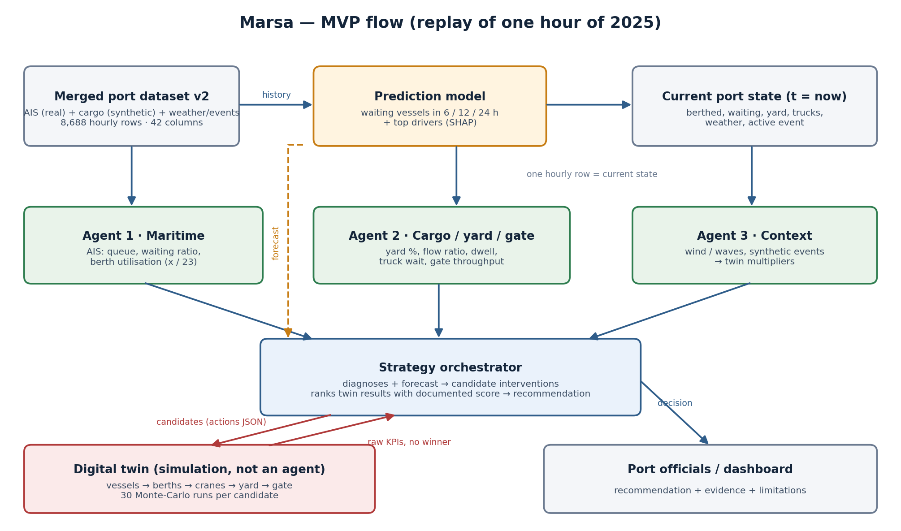

# Marsa (مرسَى) — Predictive Port Digital Twin

**AgentX Hackathon · Logistics & Ports track · Challenge (Ministry of Transport and Logistic Services): *Predicting cargo congestion and shipment delays in ports.***

Marsa forecasts port congestion from real vessel-traffic (AIS) data, lets three specialist AI agents diagnose
*where* the pressure is (sea side, yard/gate, external context), asks a strategy agent to propose interventions,
tests every intervention in a digital twin, and returns a ranked recommendation with evidence.
Nothing is executed automatically — the port operator takes the final decision.

<p align="center"></p>

---

## 1. How Marsa works (one decision cycle)

| Step | Component | What it does | Where |
|---|---|---|---|
| 1 | **Port state** | One hour of the merged dataset is treated as "now" (replay of 2025) | `src/marsa/data/load.py` |
| 2 | **Prediction model** | XGBoost forecasts congestion risk in the next 6 h + risk level | `src/marsa/model/` · `prediction_model/` |
| 3 | **Agent 1 · Maritime** | Vessel queue, waiting ratio, berth occupancy (x / 23) from AIS | `src/marsa/agents/maritime_agent.py` |
| 4 | **Agent 2 · Cargo** | Yard occupancy, container flow, dwell, truck/gate pressure | `src/marsa/agents/cargo_agent.py` |
| 5 | **Agent 3 · Context** | Weather and external events → twin multipliers | `src/marsa/agents/events_weather_agent.py` |
| 6 | **Strategy agent** | Reads forecast + 3 diagnoses → candidate interventions | `src/marsa/agents/strategy_agent.py` |
| 7 | **Digital twin** | Simulates every candidate (vessels → berths → cranes → yard → gate), 30 Monte-Carlo runs each | `src/marsa/twin/` |
| 8 | **Strategy agent** | Ranks twin results with a documented score, writes the recommendation (Arabic, Gemini-assisted) | `src/marsa/agents/strategy_agent.py` |
| 9 | **Dashboard / API** | Shows state, forecast, drivers, recommendation | `dashboard/marsa.html` · `src/marsa/api/` |

Design rules: agents describe and diagnose, they never invent numbers; the LLM (Gemini) only rewrites narrative
and is rejected if it adds numbers or causal claims; every value carries provenance (`OBSERVED`, `DERIVED`,
`SYNTHETIC`, `SIMULATED`); the twin never picks a winner — ranking is a deterministic score.

---

## 2. Run it — step by step

### Requirements
- Python **3.11 or newer** (`python --version`)
- Git
- (Optional) a Gemini API key from https://aistudio.google.com → *Get API key*

### Step 1 — clone
```bash
git clone https://github.com/AnwarAldahan/Marsa.git
cd Marsa
```

### Step 2 — create and activate a virtual environment
```powershell
# Windows (PowerShell)
python -m venv .venv
.\.venv\Scripts\Activate.ps1
```
```bash
# macOS / Linux
python -m venv .venv
source .venv/bin/activate
```
You should now see `(.venv)` at the start of the prompt.
If PowerShell refuses to run the script: `Set-ExecutionPolicy -Scope CurrentUser RemoteSigned` (once), then retry.

### Step 3 — install dependencies
```bash
pip install -r requirements.txt
```

### Step 4 — (optional) enable the LLM narrative
Without this step Marsa runs fully deterministic (same numbers, plainer text).
```powershell
copy .env.example .env        # macOS/Linux: cp .env.example .env
```
Open `.env` and set your key — no quotes, no spaces:
```
GEMINI_API_KEY=your_key_here
```
`.env` is git-ignored and must never be committed. Each should creates their own.

### Step 5 — check everything works
```bash
python -m pytest -q tests
python -m ruff check src tests scripts
```
Expected: all tests pass (≈ 240) and ruff reports no issues.

### Step 6 — run one decision cycle from the command line
```bash
python scripts/run_pipeline.py 2025-07-10T19:00:00Z --save
```
Timestamps must be **UTC with a trailing `Z`** and must exist in the 2025 timeline.
Output: the decision-support JSON in the terminal and `outputs/run_20250710T19.json`.

### Step 7 — start the backend (terminal 1)
```powershell
$env:PYTHONPATH="src"; python -m uvicorn marsa.api.main:app --reload      # Windows
```
```bash
PYTHONPATH=src python -m uvicorn marsa.api.main:app --reload             # macOS / Linux
```
Wait for `Application startup complete`. Swagger UI: http://127.0.0.1:8000/docs

### Step 8 — start the dashboard (terminal 2)
```bash
cd dashboard
python -m http.server 5500 --bind 127.0.0.1
```
Open **http://127.0.0.1:5500/marsa.html**.
Use the selector at the top to pick an hour (or type any UTC hour) and press **تحميل**.

### Step 9 — stop
`Ctrl+C` in each terminal. After editing Python files or `.env`, restart terminal 1 only;
after editing `marsa.html`, just refresh the browser.

### Good hours to demo
| Hour (UTC) | Why |
|---|---|
| `2025-07-10T19:00:00Z` | peak: 19 vessels waiting, 16/23 berths busy, yard 95 % |
| `2025-07-07T22:00:00Z` | berths almost full |
| `2025-01-13T18:00:00Z` | active external event |
| `2025-01-05T10:00:00Z` | elevated weather |
| `2025-05-14T06:00:00Z` | calm |
| `2025-11-02T08:00:00Z` | missing weather → agent reports *unknown* |

---

## 3. API

| Method | Path | Body | Returns |
|---|---|---|---|
| GET | `/health` | — | liveness |
| POST | `/api/agents/maritime/investigate` | `{"timestamp_utc": "2025-07-10T19:00:00Z"}` | Agent 1 assessment |
| POST | `/api/agents/cargo/investigate` | same | Agent 2 assessment |
| POST | `/api/agents/events-weather/investigate` | same | Agent 3 assessment |
| POST | `/api/decision-support/analyze` | same | full cycle: state, forecast, agents, twin results, recommendation |

Example from PowerShell (backend running on port 8000):
```powershell
Invoke-RestMethod -Method Post -Uri http://127.0.0.1:8000/api/decision-support/analyze `
  -ContentType application/json -Body '{"timestamp_utc":"2025-07-10T19:00:00Z"}'
```

Every response carries `reasoning_mode`: `deterministic`, `llm_assisted`, or `deterministic_fallback`
(LLM answer rejected by the guardrails). Errors: 404 = hour not in timeline, 422 = bad timestamp.

---

## 4. Repository structure

```
Marsa/
├── README.md
├── requirements.txt · pyproject.toml · .env.example · .gitignore · .gitattributes
├── config/port_config.yaml        ★ every port parameter and assumption, tagged SOURCE / DERIVED / ASSUMPTION
├── data/
│   ├── external/                  berth-occupancy columns derived from raw AIS
│   └── processed/
│       ├── merged_port_dataset_2025_v1.csv   pure merge of the three agent datasets (frozen)
│       ├── merged_port_dataset_2025_v2.csv   v1 + berth columns  ← runtime input
│       ├── event_registry_2025.csv           synthetic events registry
│       └── ml_modeling_table_c1.parquet      AIS-only table (2023–2025) used by the C1 model
├── src/marsa/
│   ├── data/          loader, hourly snapshot, gap-safe features/targets
│   ├── model/         runtime inference contract for the prediction model
│   ├── agents/        maritime · cargo · events_weather · strategy · gemini/llm · remote (HTTP adapter)
│   ├── twin/          engine (simulation) · state/adapter (snapshot → scenario) · scoring
│   ├── api/           FastAPI app, routes, schemas
│   ├── provenance/    provenance types
│   └── pipeline.py    one decision cycle
├── prediction_model/  training code, artifacts and results of the cargo-congestion model (XGBoost 1/3/6/12 h)
├── artifacts/models/  C1 maritime congestion model (XGBoost) + metadata + SHAP explainers
├── reports/           data audit, model evaluation, calibration, thresholds
├── scripts/           run_pipeline.py · build_v2_dataset.py · berth_occupancy_from_ais.py · events/weather builders
├── dashboard/         marsa.html (dashboard + twin console) · README_DASHBOARD.md
├── tests/             agents, API, twin, features, integration, prediction pipeline
└── docs/              DATA_DICTIONARY · ARCHITECTURE · LIMITATIONS · NEXT_STEPS · figures
```

---

## 5. Data

| Layer | Source | Provenance | Notes |
|---|---|---|---|
| Vessel traffic | NOAA AIS via Kaggle *LA/LB Maritime Trajectory & AIS Dataset 2023-2025* (CC BY 4.0) | OBSERVED → hourly DERIVED | 21.7 M pings → 8,688 hours of 2025 |
| Berth occupancy | derived from raw AIS (cargo vessels stationary inside the LA port area) | DERIVED | validated against Marine Exchange daily counts |
| Weather | Open-Meteo (LA/LB), hourly | OBSERVED | wind, wave height, WMO code |
| Cargo / yard / gate | generated, calibrated to official Port of Los Angeles 2025 monthly TEU and PMSA dwell times | SYNTHETIC | port-level, normalised yard scale (10,000 units) |
| External events | generated with a fixed seed, independent of AIS | SYNTHETIC | 15 events, 172 hours |

Port of Los Angeles is a **stand-in**: Eastern Province port data was requested and not made available.
Everything port-specific lives in `config/port_config.yaml` (23 container berths, 79 cranes, …).
72 source hours are missing from the AIS timeline and are deliberately **not** filled.
Full column list: `docs/DATA_DICTIONARY.md`.

---

## 6. Prediction models

| Model | Target | Inputs | Test period | Result |
|---|---|---|---|---|
| **C1 maritime congestion** (`artifacts/models/`) | observed AIS label (≥ 17 waiting vessels *or* high density + low speed) in the next 6 h | AIS + weather | Jul–Dec 2025 | ROC-AUC 0.97 · PR-AUC 0.83 (persistence baseline 0.49) |
| **Cargo-congestion proxy** (`prediction_model/`, used at runtime) | rule-based proxy from cargo/yard/gate stress, next 1/3/6/12 h | AIS + synthetic cargo | walk-forward folds | `prediction_model/final_proxy/results/` |

The C1 model has an **observed** target, so its accuracy is the headline number. The runtime proxy model extends
the forecast to the landside; because its target is synthetic, its accuracy is internal consistency, not
real-world accuracy (see `docs/LIMITATIONS.md`).

---

## 7. Digital twin

Hour-stepped simulation starting from the current port state: vessel arrivals (Poisson, rate from Little's law)
→ berth queue (FCFS / shortest-first / priority) → discharge (crane rate) → yard stock-flow → gate clearance.
Each candidate runs 30 times on identical random streams and reports mean / p10 / p90 of average wait, max wait,
delayed vessels, berth utilisation and yard occupancy. Actions: `queue_policy`, `add_berths`, `crane_boost`,
`gate_boost`, `delay_arrivals`, `prioritise_vessel`. Weather and events enter as capacity multipliers.

---

## 8. Tech stack

Python 3.11 · pandas / NumPy / PyArrow · XGBoost · scikit-learn · SHAP-style explainers · Pydantic v2 ·
FastAPI + Uvicorn · Gemini API (optional narrative) · pytest · ruff · HTML/JS dashboard.

---

## 9. Limitations and next steps

`docs/LIMITATIONS.md` and `docs/NEXT_STEPS.md`. In short: stand-in port, container chain only, synthetic landside,
single-terminal twin calibrated to dataset scales, documented (not cost-derived) score weights.
With Mawani / TOS data for King Abdulaziz Port the same code runs unchanged: only the config and the three
input datasets change.

---

## 10. Team — AgentX 2026 · Team Marsa

| Name | GitHub | Role |
|---|---|---|
| Anwar Aldahan | [@AnwarAldahan](https://github.com/AnwarAldahan) | Data integration, repository, digital twin, dashboard wiring & synthetic operations data |
| Sajedah Alqudaihi | [@Sajedah25 ](https://github.com/Sajedah25) | Maritime agent (AIS) & synthetic operations data & Dashboard design |
| Anfal bamardouf | [@nbamardouf-source](https://github.com/nbamardouf-source) | Cargo agent & synthetic operations data &Prediction model |
| Fatima Alawami | [@Fatima Alawami](https://github.com/FatimaAlawami3) | Events & weather agent, API, LLM integration & synthetic operations data|

